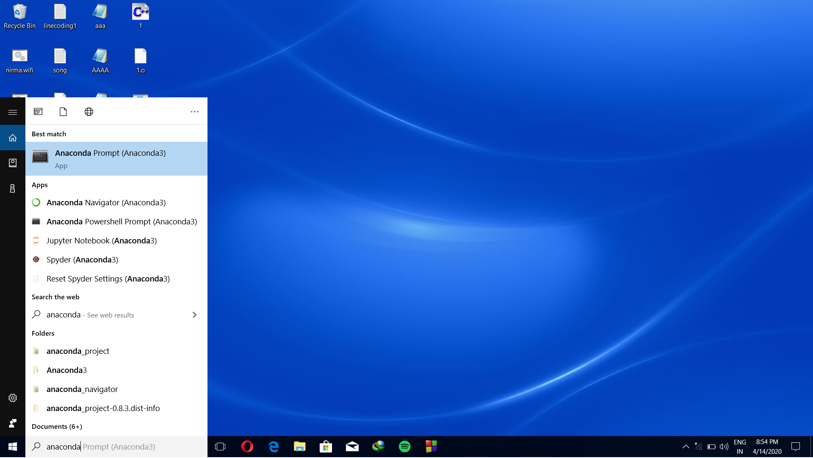
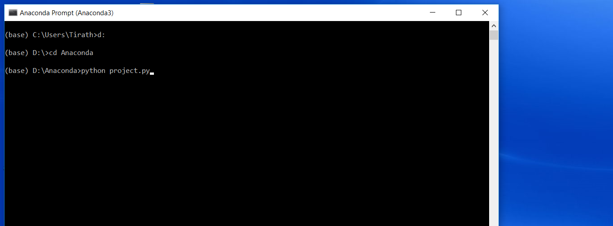
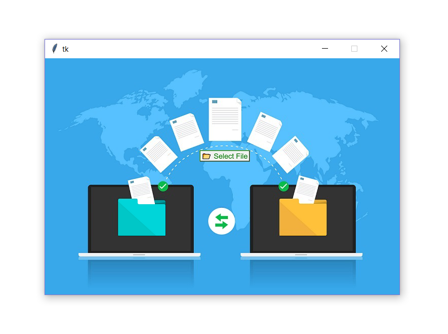
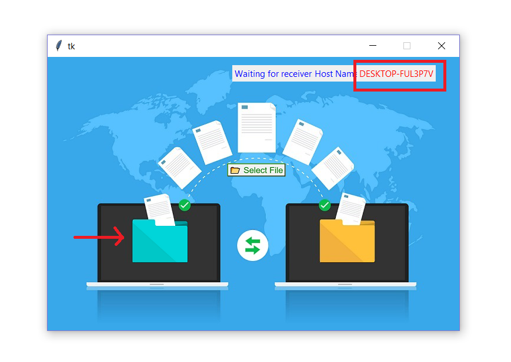
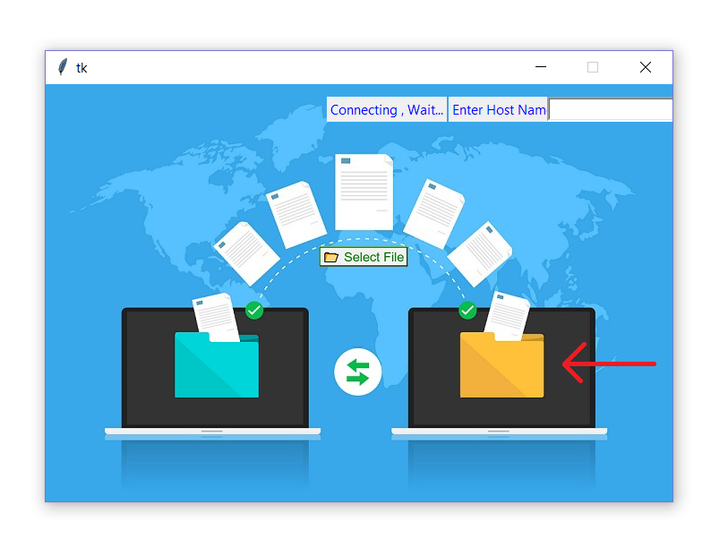
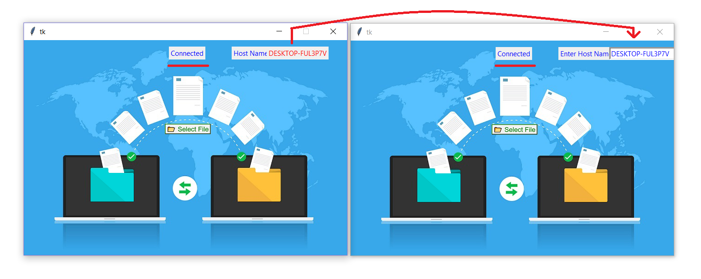
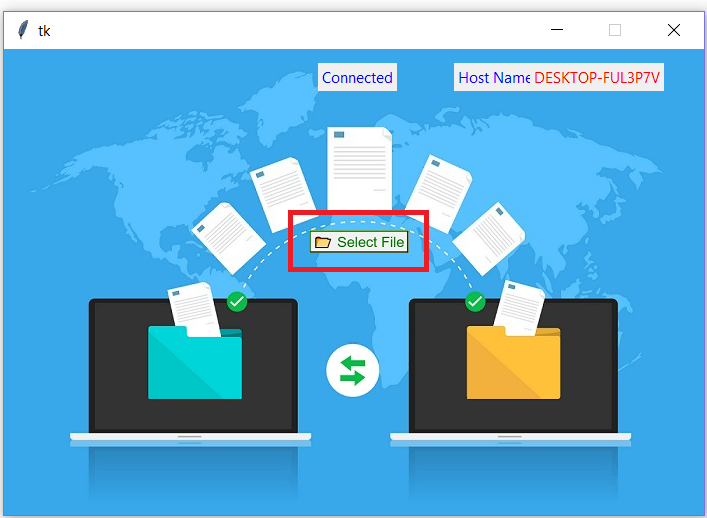
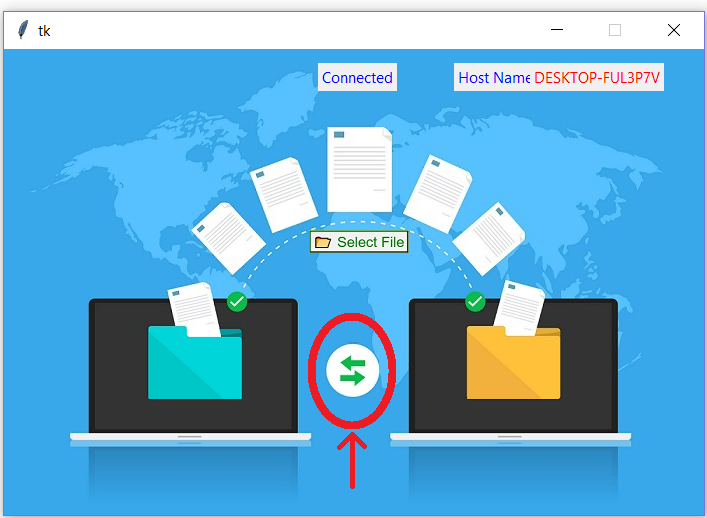

# Wireless-Media-Transfer
Wireless Transmission of data between Laptops using Socket Programming in Python

## NOTE:
Download Python_Project Folder and run project.py file inside it.
Don't change the contents of the folder.

## Requirements: 
1) You will need 2 laptops and both the laptops connected over same wi-fi network ( For example: Connect both the laptop with your mobile phone HOTSPOT without internet connection. )

2) Both the laptop should have Anaconda installed in it to run the Project(Python) file. 

## Steps to run the Project(Python) file and open it.…
  Step 1: Open Anaconda Prompt(Anaconda 3) app in your laptop.
  
  Step 2: Go to the directory where this Project(Python) file is located.

  Step 3: Run this ( python project.py ) command in the prompt.

  Step 4: After running the previous command a GUI (Tkinter) window will pop up.
  
## How the Project works….

### 1) To Connect :

Step 1: The user which clicks the BLUE file explorer button becomes the HOST and the HOSTNAME is generated at the RIGHT–TOP corner.
  
  
Step 2: The user which clicks the YELLOW file explorer button becomes the CLIENT.
  
  
Step 3: To connect the client to the host type the HOSTNAME in the RIGHT-TOP corner on the CLIENT side and press ENTER.

Step 4: CONNECTED is displayed at the center of both the GUI, so it means the connection is established.
  

### 2) To Transfer :

Step 1: Anyone (CLIENT or HOST) can press the SELECT FILE button after the connection is established.
  

Step 2: Select the file that is to be transferred and press Open.

Step 3: Press the Data Transfer Button located in between the Blue and Yellow file explorer button.
  

Step 4: File will be RECEIVED in the same folder/location where the Project(Python) file is located.

Step 5: Wait until the data is transferred and then you can again ENJOY with transferring more and more data that too without INTERNET.
### 3) To Disconnect:

Step 1: Just simply close your GUI (Tkinter) by clicking close button to disconnect the host and the client connection.

## Advantages: 

1) Wireless Media(Audio+Video) Transfer amongst two laptops over same Wi-Fi network without using INTERNET Source.

2) HOST can send data to CLIENT as well as CLIENT can sent data to HOST but not at the same time.

3) The Average Transfer Speed is greater than equals to 2 Mbps.
